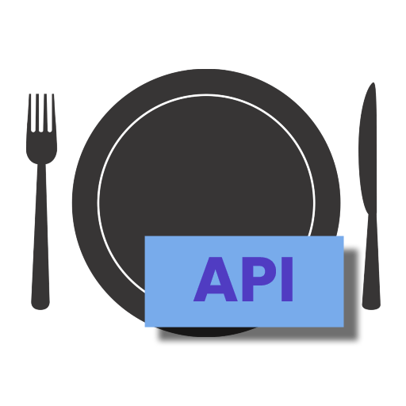

</img>

# EateryCacher

EateryCacher is a simple HTML-to-human menu converter, which can be used to get lunch data from [Eatery](https://eatery.se) Restaurants.

> *Note:* EateryCacher uses inoffical APIs (they are used on Eatery's website, but there is no official documentation available).
Code may be subject to errors and stop work if the API changes. **Note:** Please do not misuse the API, especially since it is unofficial.
> If you are a Eatery representative that is unhappy with this usage of the API, let me know and I will stop crawling data from you as well as make this
repository read-only/archived and/or hidden.

### Hosted versions

**For Eatery Kista Nod:**

A hosted version serving the Eatery Kista Nod menu is available at https://lunchmeny.albins.website/.

A human-readable website using the menu API is available at https://20alse.ssis.nu/lunch/.

Or, you can of course set up your own server or just use the parsing scripts supporting virtually *any* Eatery restaurant! Instructions can be found below.

### Setup

The main files that are relevant for you here are:
* `config.ini` - See below.
* `create_server.py` - Creates the server in accordance to your configuration
* `update_data_from_api.py` - Updates and parses data from Eatery's servers and saves them onto the server.

#### How the cacher works

The cacher tries to download new data from the Eatery API and saves it onto a directory where cached menus live (`cached/`). This is done by *running the script*
`update_data_from_api.py`. The data can then be served, in parsed format, by running the file `create_server.py`.

#### Setting up a server

*While the server file can be run directly*, it is **not** recommended for production! Default development servers are not supported. In a production environment, use a server like
Gunicorn (it's easy to set up, and Google is absolutely your friend here).

An example command for hosting with Gunicorn is `gunicorn create_server:create_app() --bind=0.0.0.0:80`

#### Installing requirements

All requirements should be listed in the [requirements.txt](requirements.txt) file.

#### Example services to get you started

There are some systemd services and bash scripts to help you get started if installing this on a Linux server.
Find them in the [systemd_services directory](systemd_services).

#### Building CSS

If you're making any changes to the HTML and use more of the [Tailwind CSS](https://tailwindcss.com) classes, the 
static/css/output.css file has to be edited. If you're cloning this to a GitHub repository, this is not a problem at all,
since there is already a GitHub Action included to make changes to the CSS automatically! If not using GitHub Actions, you
can run the following command to rebuild the CSS:

`npx tailwindcss -c tailwind.config.js -i ./src/css/input.css -o ./static/css/output.css`

### Configuring

See the file `config.ini.example` for configuration of the EateryCacher. You can copy it to `config.ini` and change the parameters.
